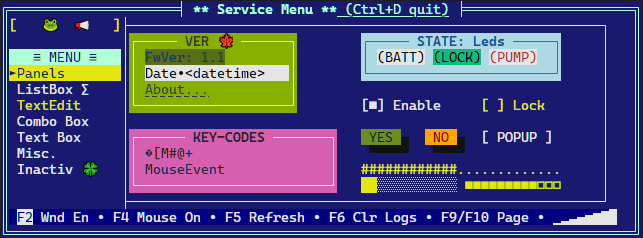
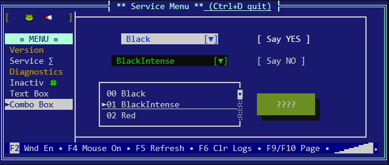
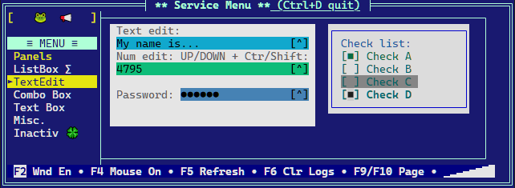

# RTWins in brief

`RTWins` is a Rust library designed for easy creation of visual terminal applications on non-os platforms, like bare Cortex-M3.
It provides basic facilities required by interactive applications such as screen and cursor management, keyboard input, keymaps, color codes.





## References

Implementation is based on:

* <https://github.com/marmidr/twins>
* [Wiki: reference color tables for different terminals](https://en.m.wikipedia.org/wiki/ANSI_escape_code)

## Primary goals

* text properties
  * [x] foreground and background color codes
  * [x] attributes (bold, inversion)
* operations
  * [x] clear screen
  * [x] go to home
  * [x] go to location
* reading input
  * [x] regular characters (a..z)
  * [x] control codes (Up/Down, Del, Ctrl, Home, ...)
* [x] buffered terminal output
* [x] platform abstraction layer (PAL) to ease porting
* [ ] command line interface with history (CLI)
* [x] #![no_std]

## Secondary goals

* widgets (controls) to implement
  * [x] window
  * [x] panel
  * [x] static label / led
  * [x] check box
  * [x] text edit (text/number)
  * [x] radio button
  * [x] page control
  * [x] progress bar
  * [x] list box
  * [x] combo box
  * [x] scrollable text box
  * [x] custom widget base
  * [x] scrollbar
  * [ ] horizontal page control
  * [x] popup windows
  * [x] layers - to control visibility of groups of widgets
  * [x] password input
* navigation
  * [x] widgets navigation by Tab/Esc key
  * [x] render focused widget state
  * [x] blinking cursor instead of inversed colors
  * [x] select widget by mouse
* notifications
  * [x] notify event per widget type (button clicked, checkbox toggled)
* [x] color theme for window
* [x] keyboard handler returns if key was handled by active widget
* [x] support for mouse click
* [x] double-width character support (emoticons 😁)
* [x] multiline solid button

---

## Prerequisites

[Install Rust](https://www.rust-lang.org/tools/install)

```bash
curl --proto '=https' --tlsv1.2 -sSf https://sh.rustup.rs | sh
```

### Build and run GUI demo

```bash
# standard runner
cargo r --example demo_full
# mini demo
cargo r --example demo_mini

# full demo with slow_flush enabled:
cargo r --features=slow_flush --example demo_full
# using justfile
just r
```

## How to build and run unit tests

```bash
# standard test runner
cargo t
# test using nextest (https://nexte.st/)
just nx
```

---

## Test coverage - `grcov`

Coverage generation tools [grcov](https://github.com/mozilla/grcov) is provided by Mozzilla.

First, [nightly](https://rust-lang.github.io/rustup/concepts/channels.html) version of Rust is needed:

```bash
rustup show
rustup toolchain install nightly
rustup show
rustup default nightly
```

Now install dependencies:

```bash
cargo install grcov
rustup component add llvm-tools-preview
```

Build and test

```bash
export LLVM_PROFILE_FILE="your_name-%p-%m.profraw"
export CARGO_INCREMENTAL=0
export RUSTFLAGS="-Zprofile -Ccodegen-units=1 -Copt-level=0 -Clink-dead-code -Coverflow-checks=off -Zpanic_abort_tests -Cpanic=abort"
export RUSTDOCFLAGS="-Cpanic=abort"
cargo +nightly test
grcov . --source-dir . --binary-path ./target/debug/ -t html --branch --ignore-not-existing --ignore "tests/*" -o ./target/debug/coverage/
```

Open the `target/debug/coverage/index.html` to see the report

---

## Test coverage - `tarpaulin` (only Linux +x86)

https://lib.rs/crates/cargo-tarpaulin

```bash
cargo install cargo-tarpaulin
cargo tarpaulin --out Html --skip-clean
```

Cons:

* runs `cargo clean` every time you switch between `cargo test` and `cargo tarpaulin`
* uses source files to generate html report details on-the-fly
* `--count` is not working
* no branch coverage

---

## `nextest` - faster test runner for Rust

cargo-nextest, a next-generation test runner for Rust projects

https://nexte.st/book/pre-built-binaries.html

## `expand` - macro expansion tool

Install from sources:

```sh
cargo install cargo-expand
```

## `bloat` - what takes most of the space in your executable

https://github.com/RazrFalcon/cargo-bloat

```sh
cargo install cargo-bloat
```

## `audit` - performs vulnerabilities check

https://crates.io/crates/cargo-audit

```sh
cargo install cargo-audit
```

## `just` - convenient commands

Package comes with the `Justfile` - make-like collection of useful commands.

https://github.com/casey/just
