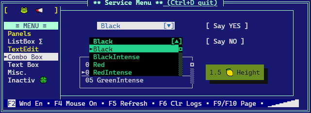

# RTWins in brief

`RTWins` is a Rust library designed for easy creation of visual terminal applications on non-os platforms, like bare Cortex-M3.
It provides basic facilities required by interactive applications such as screen and cursor management, keyboard input, keymaps, color codes.




## References

Implementation is based on:

* <https://github.com/marmidr/twins>
* [Wiki: reference color tables for different terminals](https://en.m.wikipedia.org/wiki/ANSI_escape_code)

## Primary goals

* text properties
  * [x] foreground and background color codes
  * [x] attributes (bold, inversion)
* operations
  * [x] clear screen
  * [x] go to home
  * [x] go to location
* reading input
  * [x] regular characters (a..z)
  * [x] control codes (Up/Down, Del, Ctrl, Home, ...)
* [x] buffered terminal output
* [x] platform abstraction layer (PAL) to ease porting
* [ ] command line interface with history (CLI)

## Secondary goals

* widgets (controls) to implement
  * [x] window
  * [x] panel
  * [x] static label / led
  * [x] check box
  * [ ] edit field (text/number)
  * [x] radio button
  * [x] page control
  * [x] progress bar
  * [x] list box
  * [x] combo box
  * [ ] scrollable text box
  * [ ] custom widget base
  * [x] scrollbar
  * [ ] horizontal page control
  * [ ] popup windows
  * [x] layers - to control visibility of groups of widgets
  * [ ] password input
* navigation
  * [ ] widgets navigation by Tab/Esc key
  * [ ] render focused widget state
  * [ ] blinking cursor instead of inversed colors
  * [ ] select widget by mouse
* notifications
  * [ ] notify event per widget type (button clicked, checkbox toggled)
* [ ] color theme for window
* [ ] keyboard handler returns if key was handled by active widget
* [ ] support for mouse click
* [x] double-width character support (emoticons 😁)
* [x] multiline solid button

## Prerequisites

[Install Rust](https://www.rust-lang.org/tools/install)

```bash
curl --proto '=https' --tlsv1.2 -sSf https://sh.rustup.rs | sh
```

### Build and run GUI demo

```bash
cargo r
# with fast_fill enabled:
cargo r --features=fast_fill
```

## How to build and run unit tests

```bash
cargo t
# to show println! messages from tests:
cargo test -- --color always --nocapture
```

## Test coverage

Coverage generation tools [grcov](https://github.com/mozilla/grcov) is provided by Mozzilla.

First, [nightly](https://rust-lang.github.io/rustup/concepts/channels.html) version of Rust is needed:

```bash
rustup show
rustup toolchain install nightly
rustup show
rustup default nightly
```

Now install dependencies:

```bash
cargo install grcov
rustup component add llvm-tools-preview
```

Build and test

```bash
export LLVM_PROFILE_FILE="your_name-%p-%m.profraw"
export CARGO_INCREMENTAL=0
export RUSTFLAGS="-Zprofile -Ccodegen-units=1 -Copt-level=0 -Clink-dead-code -Coverflow-checks=off -Zpanic_abort_tests -Cpanic=abort"
export RUSTDOCFLAGS="-Cpanic=abort"
cargo test
grcov . -s . --binary-path ./target/debug/ -t html --branch --ignore-not-existing -o ./target/debug/coverage/
```

Open the `target/debug/coverage/index.html` to see the report
